# Road-Buddy

=== OVERVIEW ===

=== Overall Concept === 

‘10-44’ is the winning application of General Assembly’s first West Coast Hackathon. The hackathon theme was to create an application that would help delivery drivers during the holidays. ‘10-44’ matches users based on shared interests to help address the loneliness long-haul truckers face during busy working seasons. This app was created by an eight-person cross-functional team consisting of four software engineers and four UX/UI designers in less than 3 days. 

‘10-44’ is a full-stack Express/Node/Mongoose application that uses EJS templating to render dynamic web pages. It features a robust, session-based user auth system, an efficient matching algorithm that pairs users based on shared interests, and a working two way messaging system so users can communicate directly on the app. The app demonstrates full CRUD functionality, RESTful routing, a mobile-centered design, and a clean, modern user interface. 

=== Link to live site ===

You can access ‘10-44’ and begin connecting with other truckers here:

https://roadbuddy1044.herokuapp.com/

=== Developer Installation ===

To install this application on your local machine, fork and clone down the repo. 

You will need node.js to run this application on your local machine. Run "npm install" to download all dependencies for the application.

Once all dependencies are downloaded, you can spin up the application with "node server.js". 

=== Engineering Team ===

Brian Pham | https://www.linkedin.com/in/brianpham-se/

Kenny Jean | https://www.linkedin.com/in/kennyjean19/

Nick Arredondo | https://www.linkedin.com/in/nickarredondo/

John D. Watt | https://www.linkedin.com/in/john-d-watt/ 

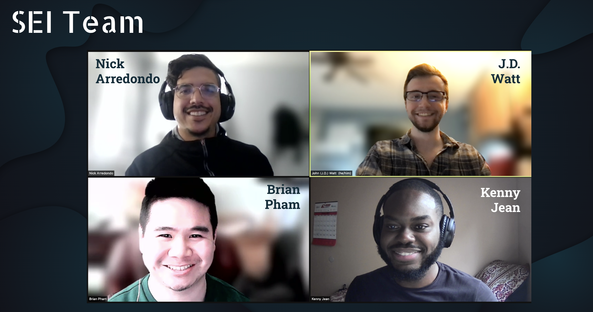

=== UX/UI Team ===

Jessica Ritter | https://www.linkedin.com/in/jessicalritter/ 

Lillie Frankowski | https://www.linkedin.com/in/lillief/ 

Anthony Toledo | https://www.linkedin.com/in/anthony-j-toledo/ 

Karen Gamber | https://www.linkedin.com/in/karengamber/ 

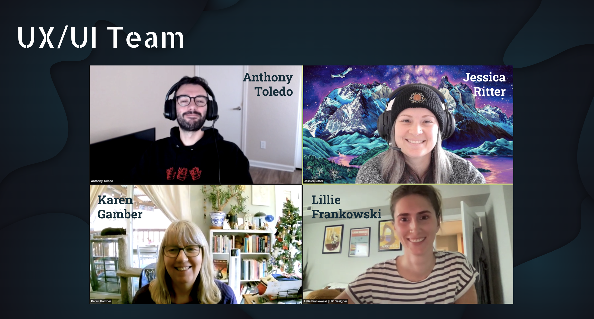

=== Main Technologies ===

- JS
- Node
- Express
- Mongoose
- MongoDB 
- EJS 
- jQuery

=== Pictures of Site ===

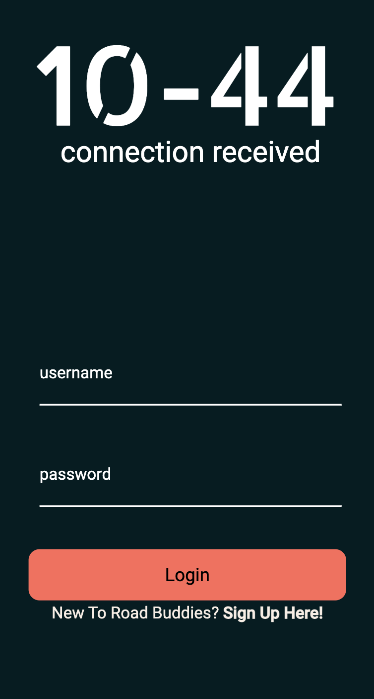

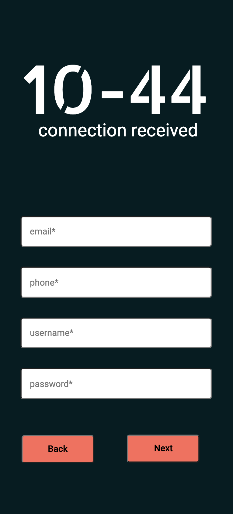

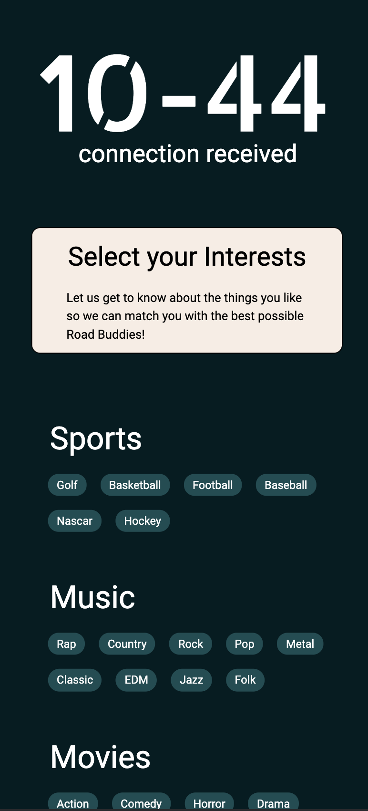

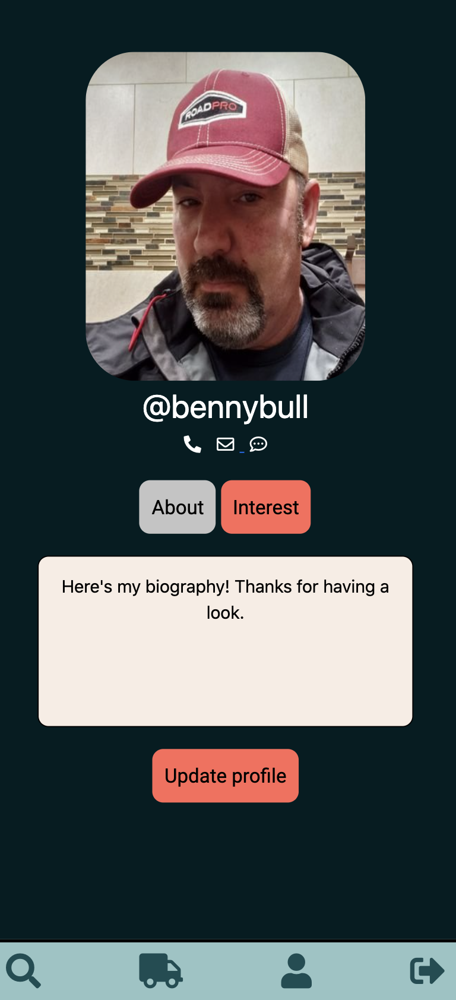

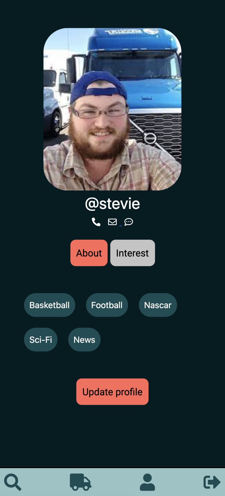

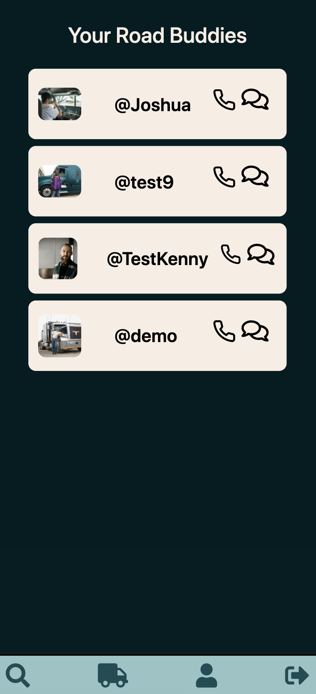

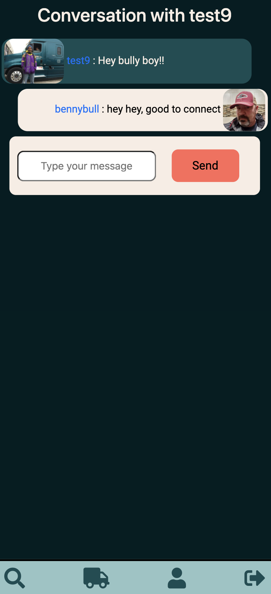

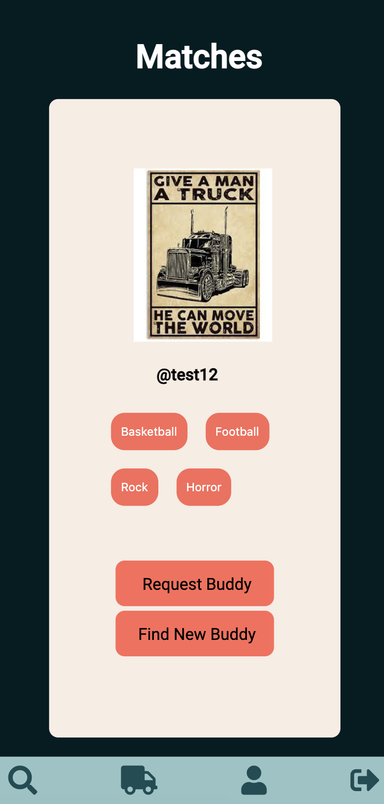

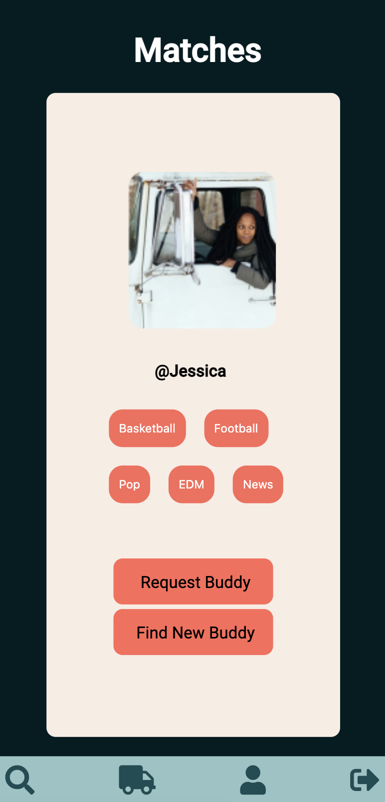

=== UX/UI DESIGN MATERIALS ===

=== User Research ===

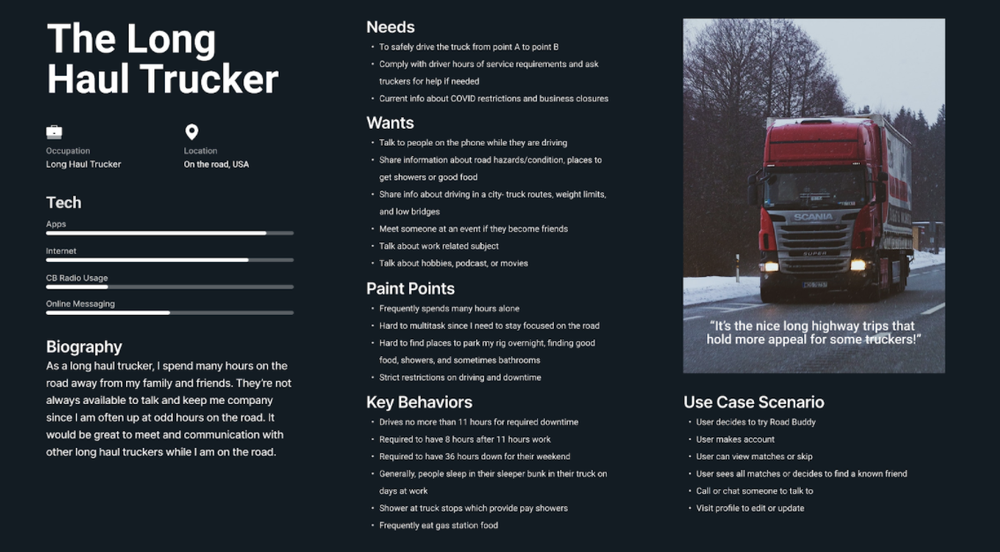

=== MOODBOARD ===

=== USER FLOW DIAGRAM ===

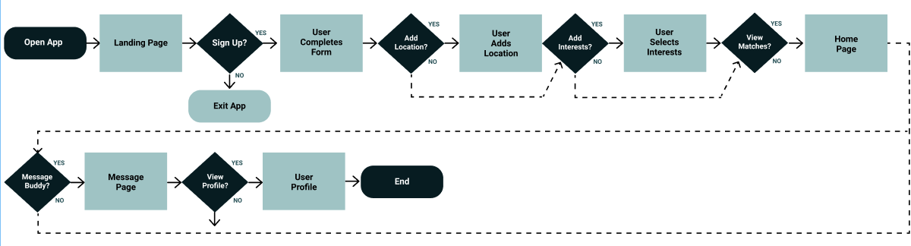

=== WireFrames ===
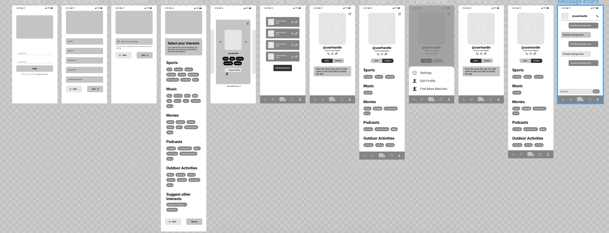

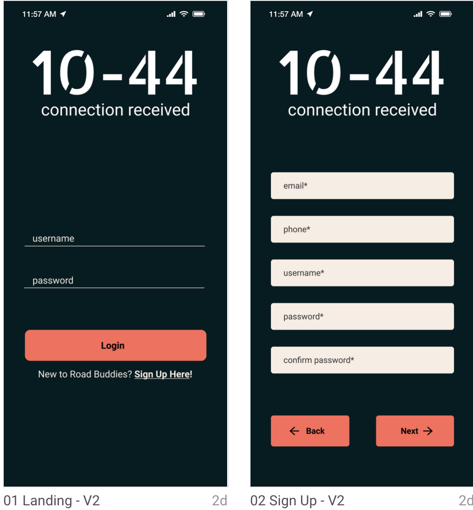

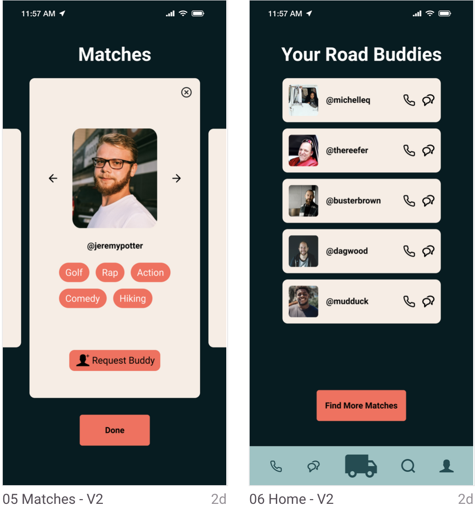

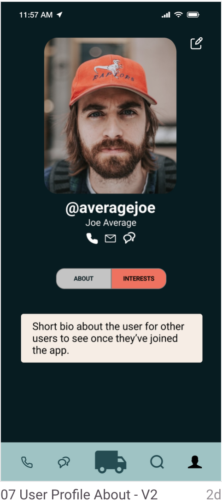

